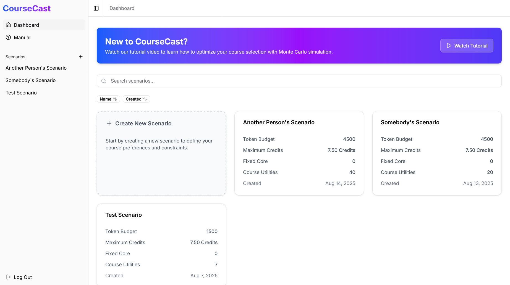
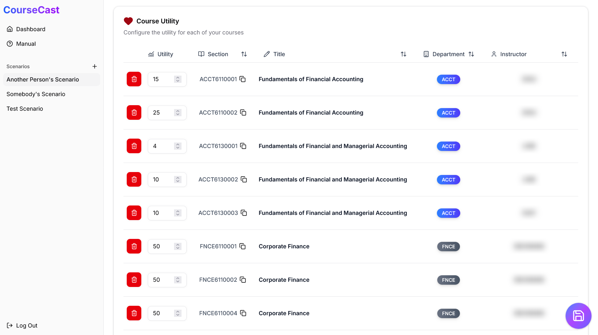
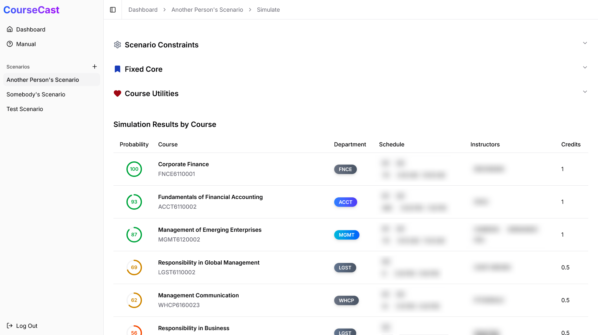

This is the story of how I made a Monte Carlo simulation of student schedule assignments **600x faster** with web workers.

Here is our baseline: the original prototype struggled to handle ~100 concurrent users. Each simulation request to the compute server took a whole minute (~60 seconds) to complete, which incidentally exasperated the resource limits of the deployment.

In this article, we'll discuss the steps that I took to make the application virtually infinitely scalable (i.e., no server compute bottleneck) thanks to sub-second client-side execution. _That's faster than a page load!_ 🔥

### Simulating Course Match with CourseCast

CourseCast is a course schedule simulator by [Derek Gibbs][derek-gibbs] for the [Course Match][course-match] system of the [Wharton School][wharton-school] of the [University of Pennsylvania][u-penn]. In the actual Course Match system, each student rates desired courses on a scale from 0 (least desired) to 100 (most desired). This score is known as the **"course utility"**.

[derek-gibbs]: https://www.linkedin.com/in/derekjgibbs/
[course-match]: https://mba-inside.wharton.upenn.edu/course-match/
[wharton-school]: https://www.wharton.upenn.edu/
[u-penn]: https://www.upenn.edu/

On simulation day, the Course Match algorithm determines the **"clearing price"** for all offered courses based on their supply and demand. Upon completion, Course Match will have been able to assign schedules to each student (in a single round!) such that the course utilities and obtained credits are maximized given the student's respective budget constraints.

> 💡 You can think of Course Match as an autonomous shopper that "buys" courses on behalf of the student. The purchasing power is only limited by the student's token budget, their maximum workload/credits, and their assigned utilities. The higher the token budget, the greater the student's capability to "afford" the clearing price for a course.



Since it's impossible to know ahead of time what the actual clearing prices will be, CourseCast instead forecasts the clearing prices based on the most recent historical data of actual clearing prices in previous Course Match runs. These predicted prices (and their statistical variances) are the "weights" of the model trained on the latest course and instructor trends.

To account for forecast uncertainty, the CourseCast model assumes that the predicted clearing price is a normally distributed random variable. As such, CourseCast runs 100 Monte Carlo simulations and counts the frequency of particular courses and schedule configurations being selected. These simulation results are presented to the user as a probability.



### So where was the bottleneck?

The original CourseCast 2024 was prototyped and deployed as a [Streamlit][streamlit] application written in Python. Students would input their course utilities and submit their simulation request to the Streamlit Community Cloud where:

- The Python back end on _shared virtual compute resources_ would parse course data and load model weights from a hosted Excel spreadsheet.
- The service would recompute all of the scheduling conflicts between courses (~200 in total). Example: classes with overlapping schedules, classes with overlapping sections, and other logistical constraints.
- Run 100 Monte Carlo simulations _sequentially_. Each of which is an instance of a linear programming solver.

[streamlit]: https://streamlit.io/

As CourseCast went viral among thousands of UPenn students, the scalability cracks began to show. When too many concurrent users hammered the Streamlit application, students couldn't run their simulations.

To be fair, the application was on the Streamlit free tier, but it was definitely high time for a rewrite to something more production-grade.

### So how did we scale CourseCast 2025?

Now that we know where the bottlenecks are, let's tackle them one by one.

#### Scrapping the Python Server

My first instinct was to ask: _is Python necessary at all?_ The Monte Carlo simulation was essentially a glorified `for` loop over a linear programming solver. Nothing about the core simulation logic was specific to Python. In fact, the only Python-specific implementation detail was the usage of Excel spreadsheet parser libraries and linear programming solver libraries for Python. I figured...

- If there was a way to package and compress the Excel spreadsheet in a web-friendly format, then there's nothing stopping us from loading the entire dataset in the browser![^1] Sure enough, the [Parquet][parquet] file format was specifically designed for efficient portability.
- If there was an equivalent linear programming solver library in JavaScript, then there's nothing stopping us from running simulations in the browser! Sure enough, there was the [`yalps`] library (among many other options).

[^1]: I must disclaim that our dataset is public and fairly small. For larger models with possibly proprietary weights, downloading the data in the browser is not an option.

[parquet]: https://parquet.apache.org/
[`yalps`]: https://www.npmjs.com/package/yalps

At this point, I was fully convinced that we could scrap the Python server and compute the simulation entirely in the browser. This approach effectively allows us to infinitely scale our simulation capacity as we would no longer be constrained by shared cloud compute limits.

That solves our scalability problem! ✅

#### Precomputing Static Course Conflicts

The next bottleneck was the course conflict generation logic. Recall that _each_ simulation request recomputes the logistical constraints on course selections (e.g., disallowing classes with overlapping schedules). This is fairly non-trivial work as there are hundreds of classes to consider.

So, naturally, the solution is to precompute these conflicts ahead of time. The precompute script takes the raw course data and appends the "conflict groups" of each course. These "conflict groups" ultimately determine the statically known logistical constraints of the linear programming solver.

> 📝 In computer science parlance, you can think of these "conflict groups" as equivalence classes defined by the relation of overlapping course schedules. That is to say, for all pairs of courses within an equivalence class, their schedules must have a non-empty schedule intersection. Thus, a "conflict group" is just a label for a group of pairwise-intersecting courses.

All of the course metadata, seeded random values, and conflict groups are embedded in a single compressed `courses.parquet` file (~90 KiB) and served to the user via a CDN for efficient delivery and caching. There is also the option of caching the file in a [Service Worker][service-worker-api], but the edge CDN already works well enough.

[service-worker-api]: https://developer.mozilla.org/en-US/docs/Web/API/Service_Worker_API

That solves our repeated work problem! ✅

#### Offloading CPU-Bound Work to a Separate Thread

The next bottleneck is the sequential execution of Monte Carlo simulation runs. There's actually no reason for us to run them sequentially because each sampled price prediction is independent from the 99 other trials. The simulation can thus be parallelized at the trial level.

Since each simulation run is primarily a linear programming solver, we know that the work is CPU-bound, not I/O-bound. The `async`-`await` model will **not** work here because [CPU-bound work blocks the event loop][avoiding-the-sequential-trap]. We **must** offload the work to another thread to keep the UI responsive.

[avoiding-the-sequential-trap]: https://dev.to/somedood/javascript-concurrency-avoiding-the-sequential-trap-7f0

In the browser, we only have one way to spawn multiple threads: through the [Web Worker API][web-worker-api].

[web-worker-api]: https://developer.mozilla.org/en-US/docs/Web/API/Web_Workers_API

```js
// The API is a little wonky in that it accepts a URL to a script.
// This will be the entry point of the web worker.
const worker = new Worker('...', { type: 'module' });
```

```js
// Modern bundlers support URL imports. Prefer this approach!
const worker = new Worker(
	// NOTE: the import path is relative!
	new URL('./worker.ts', import.meta.url),
	{ type: 'module' },
);
```

We can then wrap the worker message-passing logic in a `Promise` interface and leverage libraries like [TanStack Query][tanstack-query] for clean pending states in the UI. The example below uses React for demonstration, but this pattern is framework-agnostic.

[tanstack-query]: https://tanstack.com/query/latest

```ts
// hooks.ts
import { useQuery } from "@tanstack/react-query";

async function sendWork(request: WorkRequest) {
  // Alternatively: receive this as an argument.
  const worker = new Worker(..., { type: "module" });
  const controller = new AbortController();
  const { promise, resolve, reject } = Promise.withResolvers();

  // Set up event listeners that clean up after themselves
  worker.addEventListener("message", event => {
    resolve(event.data);
    controller.abort();
  }, { once: true, signal: controller.signal });
  worker.addEventListener("error", event => {
    reject(event.error);
    controller.abort();
  }, { once: true, signal: controller.signal });

  // Kick off the work once all listeners are hooked up
  worker.postMessage(request);

  try {
    // Parse the incoming data with Zod or Valibot for type safety!
    const data = await promise;
    return WorkResponse.parse(data);
  } finally {
    // Make sure we don't leave any dangling workers!
    worker.terminate();
  }
}

/** Useful for sending work on mount! */
export function useSendWorkQuery(request: WorkRequest) {
  return useQuery({
    queryKey: ["worker", request] as const,
    queryFn: async ({ queryKey: [, request] }) => await sendWork(request),
    // Ensure that data is always fresh until revalidated.
    staleTime: "static",
    // Ensure simulations rerun immediately upon invalidation.
    gcTime: 0,
  });
}
```

```ts
// worker.ts
self.addEventListener(
	'message',
	function (event) {
		// Parse with Zod for runtime safety!
		const data = RequestSchema.parse(event.data);
		// Do heavy CPU-bound work here
		const result: ResponseSchema = doHeavyWork(data);
		// Pass the results back to the UI
		this.postMessage(result);
	},
	{ once: true },
); // assumes one-shot requests
```

That solves our responsive UI problem! ✅

#### Parallelizing with Worker Thread Pools

A more advanced implementation of this one-shot request-response worker architecture leverages thread pools to send work to already initialized workers (as opposed to re-initializing them for each work request).

We can use [`navigator.hardwareConcurrency`] to determine the optimal number of worker threads to spawn in the pool. Spawning more workers than the maximum hardware concurrency is pointless because the hardware would not have enough cores to service that parallelism anyway.

[`navigator.hardwareConcurrency`]: https://developer.mozilla.org/en-US/docs/Web/API/Navigator/hardwareConcurrency

> ⚠️ In the previous section, the `worker` was initialized by the `sendWork` function. In a worker pool, this should instead be provided as an argument to the `sendWork` function because `sendWork` is no longer the "owner" of the thread resource and thus has no say in the worker lifetime. Worker termination **must** be the responsibility of the thread pool, not the sendWork function.

```ts
// hooks.ts
import { chunked, ranged, zip } from 'itertools';
import { useQuery } from '@tanstack/react-query';

async function doWorkInThreadPool(requests: RequestSchema[]) {
	// Yes, this is the thread pool...
	const workers = Array.from(
		{ length: navigator.hardwareConcurrency },
		(_, id) =>
			new Worker(new URL('./worker.ts', import.meta.url), {
				type: 'module',
				name: `worker-${id}`,
			}),
	);
	try {
		// Distribute the work in a round-robin fashion
		const responses: Promise<ResponseSchema>[] = [];
		for (const jobs of chunked(range(requests.length), workers.length))
			for (const [worker, job] of zip(workers, jobs)) responses.push(sendWork(worker, job));
		return await Promise.all(responses);
	} finally {
		// Clean up the thread pool when we're done!
		for (const worker of workers) worker.terminate();
	}
}

/** Execute a batch of work on mount! */
export function useThreadPoolWorkQuery(requests: RequestSchema[]) {
	return useQuery({
		queryKey: ['pool', ...requests],
		queryFn: async ({ queryKey: [_, ...requests] }) => await doWorkInThreadPool(requests),
		staleTime: 'static',
		gcTime: 0,
	});
}
```

> 📝 Request cancellation is not implemented here for the sake of brevity, but it is fairly trivial to forward the [`AbortSignal`] from TanStack Query into the thread pool. It's only a matter of terminating the workers upon receiving the `abort` event.

[`AbortSignal`]: https://developer.mozilla.org/en-US/docs/Web/API/AbortSignal

The thread pool optimization allowed us to run 100 simulations in parallel batches across all of the device's cores. Together with the precomputed conflict groups, the Monte Carlo simulation was effectively reduced from a minute to sub-second territory! 🔥

That solves our performance problems! ✅

## Conclusion

After all of these optimizations, I upgraded CourseCast from a prototype that struggled with a hundred concurrent users (with ~60 seconds per simulation request) to an infinitely scalable simulator with sub-second execution speeds (faster than a page load!).

CourseCast now guides 1000+ UPenn students to make informed decisions and (blazingly!) fast experiments about their course schedules. And we're just getting started! 🚀

Throughout this work, I had a few key takeaways:

- Always leave the door open for the possibility of offloading compute to the browser. Modern Web APIs are highly capable with great browser support nowadays. Keep exploring ways to save ourselves from the infrastructure burden of bespoke Python services.
- Always find opportunities to precompute static data. May it be through a precompute script like in CourseCast or a materialized view in the database, strive to do the least amount of repeated work.
- Keep a sharp eye out for parallelizable work. There are many opportunities in data science and general scientific computing where data processing need not be sequential (e.g., dot products, seeded simulation runs, independent events, etc.).
- Be extra mindful of the distinction between [CPU-bound work and I/O-bound work][avoiding-the-sequential-trap] when interfacing with lengthy operations in the user interface.

On a more human perspective, it's always a pleasure to have the code that I write be in service of others—especially students! As software engineers, it's easy to forget about the human users at the other end of the screen. To be reminded of the positive impact of our code on others never fails to make our work all the more worth it.

> _"Have been hearing tons of amazing feedback. Anecdotally, most people who ran simulations through CourseCast ended up without any surprises. Congrats on shipping a great product!"_

---

_Thanks to [Derek Gibbs][derek-gibbs] and the [Casper Studios][casper-studios] team for trusting me to take the lead on this project! And thanks to the Wharton School administration for their support and collaboration with us in making CourseCast as helpful as it can be for the students._

[casper-studios]: https://casperstudios.xyz/
