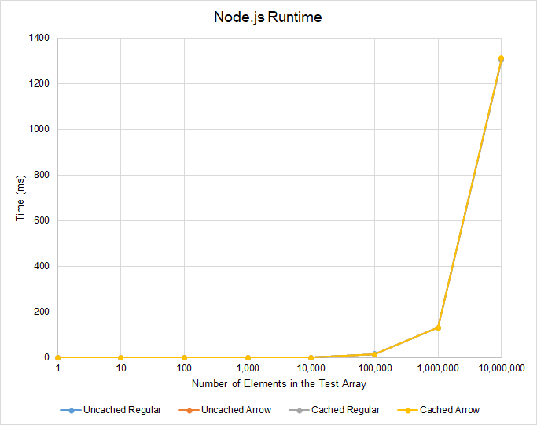
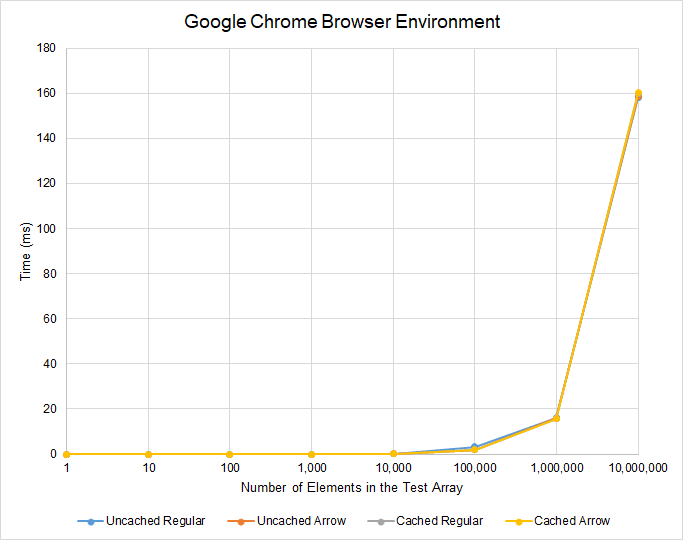
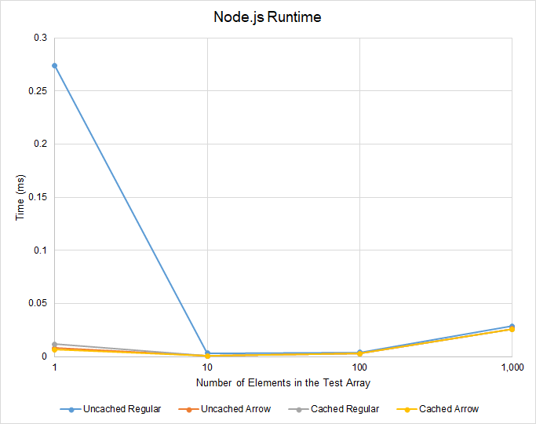
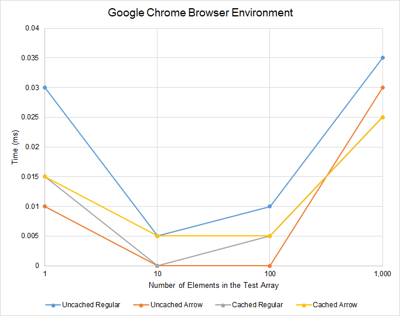
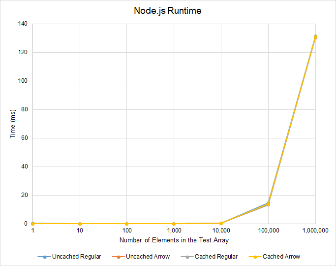
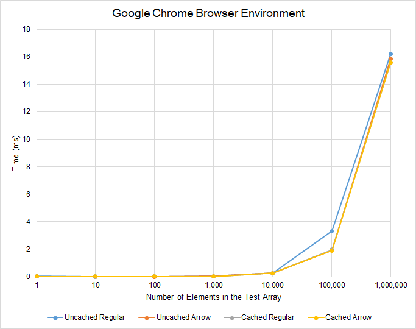

To some, mentioning the performance of JavaScript may seem like a joke. Given that it is an interpreted language, it will never be as fast as native, compiled languages such as C/C++ and Java. Although this is true, it is a great misrepresentation of the capabilities of _modern_ JavaScript. Modern JavaScript engines jump through hoops and use a bunch of tricks under the hood to optimize code. One can even argue that JavaScript is indeed fast because of these optimizations.

That brings me to my latest fascination: _storing functions_. Since I have been learning C++ for half a year now (as of writing this article), I have grown to become more intolerant of poor performance, even at the smallest scale. It is as if over the past six months, I have developed a pedantic obsession for maximizing every single CPU cycle.

This obsession influenced the way I thought about writing JavaScript code. I began to ask myself: can reusing functions make JavaScript run faster? Are modern JavaScript engines intelligent enough to optimize for this situation? Is it safe to assume that caching data (or functions in this case) for later use makes the performance of a JavaScript program better?

The short answer is yes... definitely... _to some extent_.

## Storing Functions

```javascript
// Explicit storing (function expression)
const explicitFunc = function () {};

// Implicit storing (function declaration)
function implicitFunc() {}
```

The concept of storing functions is pretty simple. We can explicitly store a function into a variable by initializing it as an expression. On the other hand, function declarations allow us to store one implicitly. [Hoisting aside](https://stackoverflow.com/questions/336859/var-functionname-function-vs-function-functionname), the two pieces of code achieve the same goal: storing a function into a variable for later use.

At this point, my obsession for memory optimization kicked in. My curious self wanted to know if using stored functions positively affected the performance of array iteration. My intuition presumed that this is indeed the case. Nonetheless, I performed an experiment to test my hypothesis.

## `Function`. Instances. Everywhere.

```javascript
const someNums1 = [1, 2, 3];
const someNums2 = [4, 5, 6];
const add1 = x => x + 1;

// Defining a new `Function` instance for each `Array#map` call
someNums1.map(x => x + 1);
someNums2.map(x => x + 1);

// Using a previously defined function
someNums1.map(add1);
someNums2.map(add1);
```

My experiment revolved around this concept (shown above). When we iterate over arrays using the `Array#map` method for example, we often pass in single-purpose arrow functions as callback functions. It may then become an issue if the same arrow functions are repeatedly redefined throughout the entire codebase, as presented in the code snippet above. Every time we define a function, a new `Function` instance is created regardless of whether or not it shares the same definition with other functions. This may prove to be inefficent over time.

```javascript
// Functions `a` and `b` share the same definition,
// but they are two different `Function` instances.
const a = x => x;
const b = x => x;
console.log(a === b); // false
```

The solution to this is surprisingly straightforward: we must store frequently used functions into variables. Retrieving the function from memory is definitely faster than constructing whole new instances of the same function definition... _or is it?_

## Methodology

| Hardware |                   Specification |
| :------- | ------------------------------: |
| CPU      | Intel Core i5-8250U 1.6GHz (x8) |
| RAM      |                    8192 MB DDR3 |
| OS       |          Windows 10.0.17763.437 |

| Runtime | Software Version |  V8 Engine Version |
| :------ | ---------------: | -----------------: |
| Chrome  |    73.0.3683.103 |         7.3.492.27 |
| Node.js |          11.14.0 | 7.0.276.38-node.18 |

To investigate further, I wrote a script that logs how long it takes for cached and uncached functions to iterate over an array of a specific size. I also tested for any performance differences between regular functions and arrow functions. I ran the script on my laptop (with okay hardware) in the browser environment (with Chrome) and the Node.js runtime.

```javascript
// This import only applies to the Node.js runtime.
const { performance } = require('perf_hooks');

// This specifies how big the array (to be iterated upon)
// can be. At the same time, it also determines how many times
// the test array must (exponentially) increase in size.
const ORDERS_OF_MAGNITUDE = 8;

// These are the cached functions.
// I tested both regular functions and arrow functions
// to see if there are any differences between the two.
function plus1Func(x) {
	return x + 1;
}
const plus1Arrow = x => x + 1;

for (let i = 1; i < 10 ** ORDERS_OF_MAGNITUDE; i *= 10) {
	// This is the test array. Its maximum size is determined
	// by the specified `ORDERS_OF_MAGNITUDE`. The test begins
	// by filling this array with only `1` element.
	// It exponentially increases in size by a factor of `10`
	// after each iteration.
	const test = new Array(i).fill(0, 0, i);

	// Uncached (regular function)
	const a0 = performance.now();
	test.map(function (x) {
		return x + 1;
	});
	const a1 = performance.now();
	const uncachedRegular = a1 - a0;

	// Cached (regular function)
	const b0 = performance.now();
	test.map(plus1Func);
	const b1 = performance.now();
	const cachedRegular = b1 - b0;

	// Uncached (arrow function)
	const a2 = performance.now();
	test.map(x => x + 1);
	const a3 = performance.now();
	const uncachedArrow = a3 - a2;

	// Cached (arrow function)
	const b2 = performance.now();
	test.map(plus1Arrow);
	const b3 = performance.now();
	const cachedArrow = b3 - b2;

	// Log results here.
	const currentTestNumber = `Test #${Math.log10(i) + 1}`;
	const elementCount = i.toLocaleString();
	console.group(`${currentTestNumber}: Testing ${elementCount} elements...`);
	console.group('Regular Function');
	console.log(`Uncached: ${uncachedRegular}ms`);
	console.log(`Cached: ${cachedRegular}ms`);
	console.groupEnd();
	console.group('Arrow Function');
	console.log(`Uncached: ${uncachedArrow}ms`);
	console.log(`Cached: ${cachedArrow}ms`);
	console.groupEnd();
	console.groupEnd();
}
```

## Results and Discussion

#### Comparing the two runtime environments




Admittedly, the results do not show anything close to a breakthrough at this scale. The data points are simply too similar with each other to even see the effects of stored functions.

However, it is worth pointing out that _at the most extreme case_, the Node.js runtime is significantly slower than the Chrome browser environment. The vertical axis of both charts plots the amount of time it took for the script to iterate over an array of a certain size (the horizontal axis). Comparing the two vertical axes, we can see that when iterating over `10,000,000` elements, the Node.js runtime takes &asymp;`1300` milliseconds to finish execution. This is a far cry from the browser environment's &asymp;`160` milliseconds.

This disparity may be explained by the fact that the Node.js runtime uses a fork of the V8 JavaScript engine that is three [minor versions](https://semver.org/#spec-item-7) behind that of Chrome. Three minor versions surely must have included numerous improvements and optimizations to the engine.

Nonetheless, I must stress that this is not to say that the Chrome browser environment _always_ optimizes array iteration better than the Node.js runtime. It is an extremely rare case to iterate over `10,000,000` elements. It would be unfair to base my conclusions off of such cases. For the usual, every day scenario, we only iterate over a few elements: perhaps somewhere around `2-100` elements if I am to make a very conservative guess. The performance differences between the two runtime environments are so negligible around this range that it would be pointless to optimize for them.

#### Zooming in to an appropriate scale

To properly see the effects of stored functions, we must zoom in and analyze the data at a smaller scale within a realistic range. To be safe, I chose to limit the data to `1-1,000` elements. Here are the results:




Besides being immediately noticeable that the Node.js runtime yielded more consistent results than the browser environment, the two charts above show a common pattern between regular functions and arrow functions (regardless of whether or not they have been cached into memory). Arrow functions tend to perform better than regular functions if used as single-purpose callback functions for the `Array#map` method.

The JavaScript engine must have optimized for the arrow function's [lack of binding to its own `this`, `arguments`, `super`, and `new.target` keywords](https://developer.mozilla.org/en-US/docs/Web/JavaScript/Reference/Functions/Arrow_functions). It can safely skip ahead generating these bindings, which in turn resulted in better performance. This optimization is especially apparent in the browser environment. Repeatedly instantiating new `Function` instances with its own bindings to the aforementioned keywords (for each `Array#map` call) has made the uncached regular functions (blue line) typically perform worse than its counterparts.

#### To cache or not to cache?

Practically speaking, the data shows that it does not matter, especially for arrow functions. The performance overhead is imperceptible, even at scale. However, if we choose to be pedantic, it is _generally_ a safe bet to cache functions, especially if these are regular functions. Contrary to intuition, it may not be the best idea to cache arrow functions.

Both charts give evidence to support this. When examining the results for an array of size `1`, it takes the Node.js runtime a total of &asymp;`0.25` milliseconds to create a whole new instance of a regular `Function` and iterate over the single-element array. Although it is only an array of size `1`, the overhead of instantiation is apparent. Caching the regular function beforehand—thus eliminating the need for complete re-instantiation—matches its performance with its arrow function counterparts.

As seen in the chart for the browser environment, caching arrow functions does not necessarily lead to better performance for arrays of size `1-100`. Caching only becomes a viable optimization for larger arrays. Since arrays typically have a size of `2-100` (as I have conservatively assumed in the previous sections), it may be better to define an arrow function callback inline than to store it in a variable for later use.

#### A change in the trend




Extending the range up to `1,000,000` elements, something interesting happens to the graph of the uncached regular function (blue line). As the number of elements in the test array increases, the uncached regular function becomes less performant. In other words, the gradient of the blue line becomes steeper as more elements are introduced into the array. This is particularly prominent in the browser environment between `10,000` and `100,000` elements.

The trend breaks after `100,000` elements. The uncached regular function could suddenly perform just as well as the other test cases. At this point, the JavaScript engine has all the information it needs to optimize the function as best as it can. This seems to be the peak of function optimization in JavaScript.

Cached or not, when iterating over a **_large_** array with a `length` property greater than `100,000`, it is safe to assume that there are no performance implications for choosing a regular function over an arrow function as a callback for the `Array#map` method. Instead of optimizing the callback function, it is much wiser to redirect our attention to the array itself. Perhaps there are better designs and architectures out there that do not require such a large array in the first place.

## Conclusion

As a general rule of thumb, caching is always a safe bet. This is especially true for regular functions, but not as much for arrow functions. Arrow functions are simply designed with array iteration in mind. It will hardly matter if an arrow function has been stored into memory beforehand. However, pedantically speaking, for arrays of size `1-100` (which is the typical use case), it is _generally_ better to define arrow functions inline than to store them into variables.

Since caching is generally a safe bet, one might assume that it is always going to improve the performance of array iteration. This is true for the typical usage, but at the largest of scales, caching nor preference of regular functions and arrow functions will matter. In fact, none of the previous recommendations will matter because a modern JavaScript engine would have enough information to optimize the array iteration as best as it can. Having an array with at least `100,000` elements is enough to signal to the engine to never mind the subtleties of the situation.

In other words, all test cases eventually approach peak optimization with a large enough array. To that end, it might be in our best interest to shift our focus to the array itself rather than optimizing callback functions. Allowing an array of such size may be an indicator of a design and architecture that needs improvement. Arrays are typically not supposed to be that huge in the first place ([even if they are theoretically allowed to have a `length` property as large as `2**32`](https://www.ecma-international.org/ecma-262/6.0/#sec-array-exotic-objects)) _unless the use case genuinely deems it necessary to crunch a lot of data_.

At the end of the day, the experiment I performed is at the scale of microseconds and milliseconds. This is a "pedant's guide" after all. It only serves as a demonstration of the subtleties of callback functions in the context of array iteration. Modern JavaScript engines indeed do a great job of optimizing the code we write, but being at such a small time scale, these types of optimizations generally do not have significant consequences to the overall performance of a program. If there is one thing that truly needs to be optimized, it is the size of arrays in a JavaScript program. A JavaScript engine can optimize callback functions as much as it wants, _but it can never optimize for inherently large inputs_.

_Array size matters._
